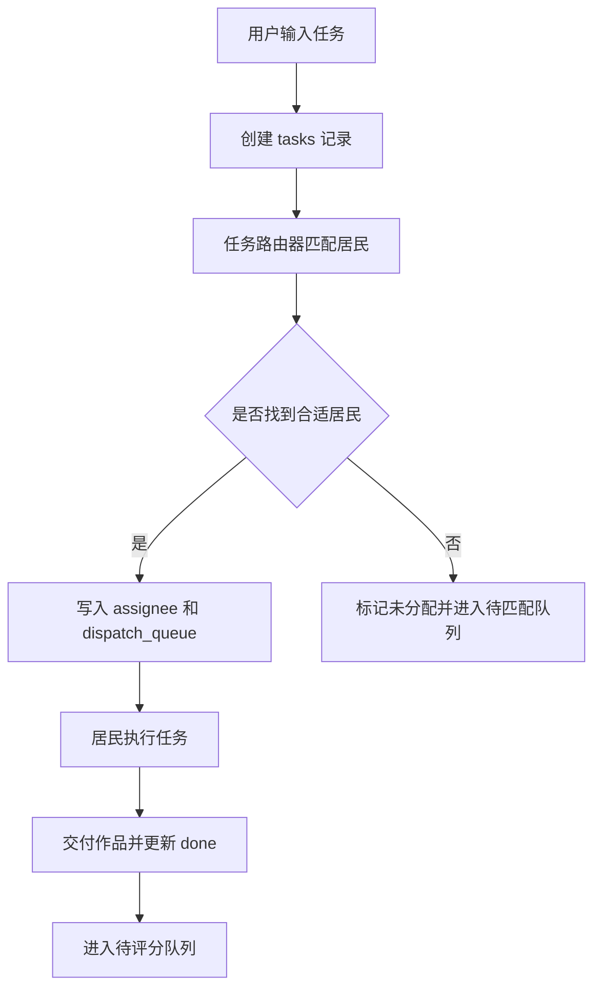
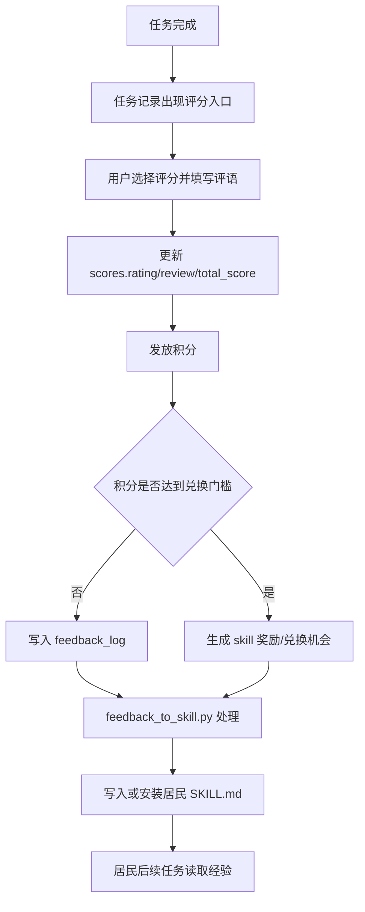
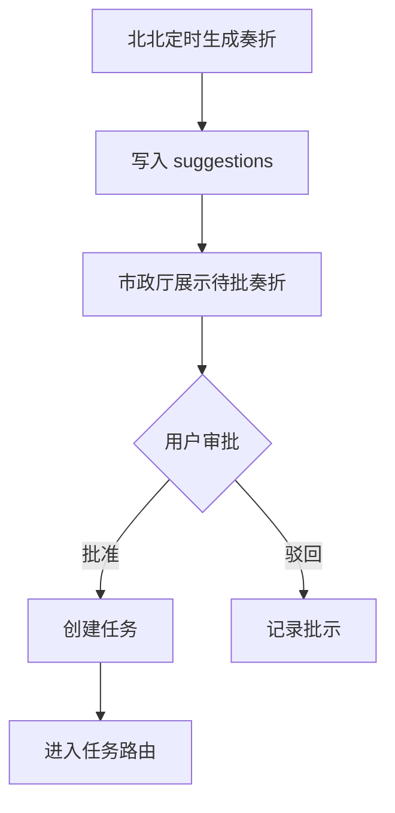

# 久久光合社 / 久久小镇 MVP 产品需求文档

版本：v1.0
日期：2026-07-04
作者：久久小镇产品组
状态：Draft

---

## 1. 产品概述

久久光合社是久久的个人主站、AI 作品策展空间和未来社群品牌。久久小镇是久久光合社里的核心世界，也是 AI 居民协作与成长的内容引擎。用户“久久”是小镇镇长，以经营者和评价者的身份管理一个由 AI 居民组成的小镇：发布悬赏、审批奏折、查看居民产出、给出评价，并通过积分奖励和 skill 学习推动居民成长。北北是小镇守护灵，负责观察小镇、整理奏折、提醒镇长做决策。

MVP 的核心不是做一个多 Agent 聊天面板，而是验证一条可持续循环：

```text
用户发布任务/审批建议
  -> 小镇自动分配给合适居民
  -> 居民交付作品
  -> 用户评价
  -> 居民获得积分
  -> 积分兑换 skill 学习机会
  -> skill 安装/沉淀到居民能力
  -> 居民下次产出质量提升
```

MVP 成功标准：镇长能感受到“居民完成了我的事，并且因为我的评价变得更好”。

长期愿景：久久所有重要的 AI 产出都能被久久小镇承载、整理、策展和展示。个人网站的关键词是“策展”：不仅展示作品，还展示作品背后的居民、skill、评价、协作过程和生活痕迹。AI 不只用于工作提效，也应该用于创造更美好、更有趣、更有温度的生活。

---

## 2. 背景与问题

当前项目已经有可运行原型：

- `town_server.py` 提供 SQLite 后端和 API。
- `town.html` 提供 Canvas 小镇、市政厅、悬赏板、任务记录、积分榜、奏折、探索和智库。
- `town.db` 中已有居民、任务、评分、奏折、反馈日志等数据。
- `feedback_to_skill.py` 已能将用户评价沉淀进居民技能卡。
- `town_watchdog.py` 已能让北北生成早中晚奏折。

但原型仍存在几个影响 MVP 体验的断点：

- 任务会积压，pending 任务不能稳定进入执行。
- 已完成任务存在大量未评分记录，成长闭环不稳定。
- 积分兑换入口存在雏形，但尚未形成“积分 -> skill 奖励 -> 装备居民”的完整流程。
- 居民能力画像不足，后续扩展到 100+ 居民时难以路由和治理。
- 积分系统目前更多是记分板，缺少明确奖励出口。

MVP 目标是先把 5 个常驻居民跑顺，而不是立即扩展居民规模。

个人网站方向上，当前已经有大量可策展素材沉淀在 `town_output/`，包括海报、日报、四格漫画、产品报告、写作检查清单、技能沉淀页等。这些内容已经证明小镇不是单纯的工具系统，而是一个能留下生活感和创作痕迹的 AI 小世界。

---

## 3. 产品定位

### 3.1 一句话定位

久久小镇是一个带游戏感的 AI 居民协作系统，让镇长像经营小镇一样调用、评价和培养 AI 居民。

久久光合社是一个以“策展”为核心的 AI 作品与小镇生活展示站。它向外展示：久久是谁，久久如何使用 AI，AI 居民创造了什么，居民如何学习和进化，以及访客未来如何“看见即所得”地获得类似产出。未来如果形成社群，也沿用“久久光合社”作为共同创作、共学和共生的品牌名。

### 3.2 差异化

| 产品类型 | 典型代表 | 核心价值 | 久久小镇差异 |
|---|---|---|---|
| 单体自定义助手 | OpenAI GPTs | 创建特定用途助手 | 久久小镇强调多居民协作、积分奖励和长期成长 |
| AI 角色陪伴 | Character.AI | 与角色对话和陪伴 | 久久小镇强调任务交付、治理和产出资产 |
| 多 Bot 聚合 | Poe | 快速创建/调用不同 bot | 久久小镇强调居民状态、积分、反馈沉淀和小镇叙事 |
| Agent 工作流 | LangGraph 等 | 多智能体流程编排 | 久久小镇面向终端用户，用游戏化界面承载治理和成长 |

### 3.3 MVP 边界

MVP 不追求完整开放世界，也不追求 100+ 居民规模。第一版只验证：

- 任务能被可靠分配和完成。
- 作品能被用户评价。
- 评价能影响奖励和技能沉淀。
- 镇长能通过小镇界面理解居民状态和小镇进展。

个人网站第一版不追求访客直接调用居民，先验证“策展展示”：

- `town_output/` 中的作品能被自动整理为作品长廊。
- 每个作品能关联类型、居民、skill、评价和产出时间。
- 访客能理解久久小镇的世界观和创作方式。
- 久久小镇能作为个人网站的核心视觉入口。

---

## 4. 目标用户与场景

### 4.1 目标用户

核心用户：久久本人，以及类似久久的 AI 工具重度使用者。

特征：

- 经常需要 AI 帮忙完成自媒体内容生产，包括出图、海报、视觉设计、微信文章、日常文案和小镇系统维护。
- 不满足于一次性 Chat，希望 AI 能记住偏好并持续进步。
- 喜欢游戏化、角色化、有叙事感的工作台。
- 愿意通过评分和反馈训练自己的 AI 团队。

### 4.2 用户角色

| 角色 | 说明 | MVP 权限 |
|---|---|---|
| 镇长久久 | 小镇拥有者，发布任务、审批奏折、评分 | 发布悬赏、评分、审批奏折、查看资产 |
| 居民 | AI 角色，按专长执行任务 | 接收任务、交付作品、获得奖励 |
| 守护灵北北 | 镇长的治理助手，不是镇长本人 | 生成奏折、汇总状态、提出建议、提醒镇长 |
| 技能精进官小匠 | skill 管家 | 根据积分和评价为居民推荐、安装、装备 skill |

### 4.3 核心用户故事

1. 作为镇长，我想发布一个任务，并看到它被自动交给合适居民，这样我不用手动判断谁适合做。
2. 作为镇长，我想在居民交付后快速评分并写一句评价，这样居民能知道哪里做得好或不好。
3. 作为镇长，我想看到居民的积分、技能和历史作品，这样我能感受到他们在成长。
4. 作为镇长，我想每天看到北北的奏折，这样我能低成本了解小镇发生了什么、哪些事项需要我决策。
5. 作为居民，我完成任务后应获得奖励，并把评价沉淀为下次行动的经验。

---

## 5. MVP 范围

### 5.1 必须包含

| 模块 | MVP 内容 |
|---|---|
| 小镇首页 | Canvas 地图、居民状态、日志、小镇资产入口 |
| 悬赏板 | 发布任务、任务自动匹配、任务状态展示 |
| 任务记录 | 展示已完成作品、评分入口、产出链接 |
| 评分系统 | excellent/good/ok/poor 四档 + 评语 |
| 积分奖励系统 | 根据评分发放积分，积分用于兑换 skill |
| 技能奖励闭环 | 用户评价写入居民 skill 卡，积分兑换新 skill 学习机会 |
| 奏折系统 | 北北生成建议，镇长批准/驳回，批准后转任务 |
| 调度与回收 | pending/processing/done 状态流转、超时回收 |
| 智库资产 | 展示居民产出的 HTML/MD 文件 |
| 个人网站策展雏形 | 作品长廊、天机阁、久久小镇入口、资产库的信息架构 |

### 5.2 暂不包含

- 多用户账号体系。
- 100+ 居民扩容。
- 完整技能市场的全网搜索和自动安装。
- 审哥、芝士、Truman 等扩展居民的常驻调度。
- 复杂社交系统。
- 真实货币支付。
- 移动端深度适配。
- 高级居民关系、剧情、季节系统。
- 访客直接调用居民生成作品。
- 完整游戏化个人网站。

---

## 6. 久久光合社与策展系统

### 6.1 网站定位

久久光合社不是传统简历或作品集，而是一个 AI 创作生活方式的策展馆。

网站需要回答四个问题：

1. 久久是谁？
2. 久久和 AI 一起创造了什么？
3. 久久小镇的居民如何协作、学习和生活？
4. 访客看到喜欢的东西后，未来如何获得类似产出？

核心表达：

```text
AI 不只用来提效，也可以用来创造更美好的生活。
有些作品有用，有些只是可爱。
但它们都来自一个真实运转的小镇。
```

### 6.2 网站主模块

| 模块 | 定位 | 目标用户 | 实现阶段 |
|---|---|---|---|
| 作品长廊 | 展示久久和小镇居民产出的优秀作品 | 所有访客 | v0.1 |
| 天机阁 | 展示 skill、居民能力和作品背后的方法 | 对 AI 创作感兴趣的访客 | v0.2 |
| 久久小镇 | 类游戏小镇界面，展示居民生活和协作 | 所有访客 | v0.2-v0.3 |
| 资产库 | 管理所有作品、prompt、skill、模板和源文件 | 久久本人，后续高级用户 | v0.1-v0.2 |
| 意图工坊 | 访客“看见即所得”，提交想要的产出 | 未来用户 | v0.4 |

品牌关系：

```text
久久光合社 = 主站 / 个人品牌 / 未来社群
久久小镇 = 光合社里的 AI 居民世界
```

模块关系：

```text
作品长廊
  展示成果
    ↓
天机阁
  解释作品背后的 skill 和居民能力
    ↓
久久小镇
  让访客看见居民如何生活和协作
    ↓
意图工坊
  访客说“我也想要”
    ↓
资产库
  沉淀产出、复用资产、再策展
    ↓
回到作品长廊
```

### 6.3 作品长廊

作品长廊是个人网站的第一门面。它负责把 `town_output/` 中有温度、有代表性的作品策展出来。

内容类型：

| 类型 | 示例 |
|---|---|
| 图片/海报 | `猫猫海报.html`、`万山无阻海报.html`、`久久每日一图.html` |
| 文章/微信稿 | `万山无阻推文.md`、后续微信文章包 |
| 漫画 | `猫猫吃醋四格.html`、`猫的双面人生四格.html` |
| 小镇日报 | `久久小镇日报.html`、`久久小镇日报_20260629_晚间版.html` |
| 产品报告 | `芝士产品体验报告.html`、`芝士需求建议_20260629_2105.html` |
| 技能沉淀 | `阿画_技能沉淀完成_06-29.html`、`小文_写作检查清单_06-29.html` |
| 实验作品 | `color_palette.html`、`小文夜话_20260629_2205.html` |

每个作品详情页应展示：

- 作品标题。
- 内容类型。
- 创作居民。
- 使用或沉淀的 skill。
- 对应任务。
- 久久评价。
- 产出时间。
- 创作故事。
- 是否可复刻。

### 6.4 天机阁

天机阁是 skill 与方法的展示空间。它不只是技能列表，而是解释“为什么这些居民能做出这些作品”。

展示内容：

- 居民已装备 skill。
- skill 来源：本地安装、评价沉淀、外部引入。
- skill 适配的任务类型。
- 代表作品。
- skill 装备前后的表现变化。
- 久久评价如何促成 skill 进化。

示例：

```text
阿画 · 四格漫画模板
来源：久久评价沉淀
代表作品：猫猫吃醋四格、猫的双面人生
效果：让阿画从“偶尔会画”变成“稳定会画”
```

### 6.5 久久小镇

久久小镇是个人网站的灵魂入口。它应逐步从当前 Canvas 小镇升级为精美的类游戏界面。

MVP 展示：

- 北北在市政厅。
- 阿程在工坊。
- 阿画在画室。
- 小文在报社。
- 小匠在天机阁。
- 今日任务、居民状态、最近作品、北北奏折。

第一阶段只读展示，不允许访客直接调用居民。

未来阶段：

- 访客可进入小镇参观。
- 访客可点击居民查看档案和作品。
- 访客可看到小镇生活流。
- 部分居民可开放给访客提交需求。

### 6.6 资产库

资产库是后台和知识仓库，优先服务久久本人。

管理对象：

- 作品文件。
- 文章素材。
- 图片素材。
- prompt。
- skill。
- 模板。
- 居民产出记录。
- 任务记录。
- 评价记录。
- 可复用组件。

资产库和作品长廊的区别：

| 模块 | 作用 |
|---|---|
| 资产库 | 收纳全部资产，偏管理和复用 |
| 作品长廊 | 策展精选作品，偏对外展示 |

### 6.7 意图工坊

意图工坊承载未来的“看见即所得”。

目标体验：

```text
访客看到一个作品
  -> 点击“我也想要”
  -> 选择风格、居民、skill 或填写需求
  -> 生成悬赏
  -> 小镇居民协作产出
  -> 产出进入资产库
  -> 优秀作品进入作品长廊
```

这一阶段需要居民调度、权限、费用、资产归属和审核机制稳定后再开放。

---

## 7. 核心流程

### 7.1 发布悬赏流程



### 7.2 评分成长流程



### 7.3 奏折审批流程



---

## 8. 功能需求

### 8.1 小镇首页

#### 8.1.1 居民地图

系统应在首页展示小镇地图和居民位置。

MVP 常驻居民包含：

| ID | 名称 | 职责 |
|---|---|---|
| guardian | 北北 | 守护灵、奏折、治理提醒 |
| engineer | 阿程 | 系统维护、Bug 修复 |
| designer | 阿画 | 自媒体视觉、出图、海报、封面、漫画 |
| writer | 小文 | 微信文章、自媒体文案、日报、角色故事 |
| skill_keeper | 小匠 | skill 管家，处理积分触发的 skill 奖励 |

后续扩展居民：

| ID | 名称 | 触发场景 |
|---|---|---|
| reviewer | 审哥 | 当作品量稳定后，引入质量审核和二次检查 |
| pm | 芝士 | 当需要外部产品视角、增长分析、阶段复盘时启用 |
| truman | Truman | 当需要创业、商业、战略判断时启用 |

展示字段：

- 名称、头像/emoji、角色。
- 积分、已装备 skill。
- 当前状态：待命、处理中、离线/心跳异常。
- 当前任务标题。

验收标准：

- AC1：进入首页后 2 秒内展示居民列表和 XP。
- AC2：点击居民可查看积分和当前任务。
- AC3：居民状态每 8 秒随 `/api/state` 刷新。

### 8.2 悬赏发布

用户可在悬赏板输入任务并发布。

输入：

- 任务标题/描述，必填，1-500 字。
- 可选 `@居民名` 指定执行者。

处理规则：

- 如果包含 `@北北/@阿程/@阿画/@小文/@小匠`，优先分配给指定居民。
- 如果未指定，根据关键词匹配：
  - 小镇治理/奏折/居民状态/调度/产品取舍 -> 北北。
  - 代码/bug/接口/数据库/修复 -> 阿程。
  - 设计/海报/图/封面/漫画/自媒体视觉 -> 阿画。
  - 文案/文章/微信/公众号/日报/小红书 -> 小文。
  - skill/技能/学习/进化/积分奖励 -> 小匠。
- 如果无法匹配，任务进入“待匹配”状态，并在悬赏板标记“未分配”。

输出：

- 创建 `tasks` 记录。
- 创建 `scores` 预记录。
- 创建 `dispatch_queue` 记录。

验收标准：

- AC1：发布成功后任务在悬赏板出现。
- AC2：带 `@阿程` 的任务必须分配给 engineer。
- AC3：关键词“修复接口报错”应分配给 engineer。
- AC4：无匹配任务不能丢失，应显示为“未分配”。

### 8.3 任务状态流转

任务状态：

| 状态 | 含义 | 进入条件 |
|---|---|---|
| pending | 待执行 | 创建后默认状态 |
| processing | 执行中 | 居民领取任务 |
| done | 已完成 | 居民提交产出 |
| failed | 执行失败 | 超时、异常或用户终止 |

规则：

- pending 任务超过 2 小时未领取，应进入“积压任务”提示。
- processing 任务超过 4 小时未完成，应由 janitor 回收为 pending。
- done 任务必须进入待评分列表。
- 同一任务不能重复发放积分。

验收标准：

- AC1：任务从 pending 到 done 的状态变化可在 UI 中看到。
- AC2：重复调用 complete 不会重复加分。
- AC3：超时任务会被记录到日志。

### 8.4 任务交付与资产

居民完成任务后，应提交产出文件或文本。

支持产出：

- HTML 文件。
- Markdown 文件。
- 文本输出。
- 多文件产出列表。

展示规则：

- 任务记录中展示作品标题、居民、完成时间、产出链接。
- 智库中展示 `town_output` 下的资产列表。
- 产出链接不可出现 HTML 转义错误或路径断裂。

验收标准：

- AC1：完成任务后，产出文件能从任务记录打开。
- AC2：`/api/assets` 返回资产列表。
- AC3：不存在的文件应显示“文件不存在”，不能导致页面崩溃。

### 8.5 评分系统

评分档位：

| rating | 中文 | 基础分 | 含义 |
|---|---|---:|---|
| excellent | 卓越 | 20 | 超预期，可作为范例 |
| good | 好评 | 15 | 达标且有亮点 |
| ok | 一般 | 10 | 基本可用，但需要改进 |
| poor | 差评 | 3 | 未达要求，必须沉淀教训 |

用户评分时必须填写评语，建议 5-200 字。

系统处理：

- 更新 `scores.rating`、`scores.review`、`scores.total_score`。
- 更新任务评分字段。
- 给居民增加积分。
- 写入 `feedback_log`。
- 如果 rating 为 poor，后续写入技能卡的“核心教训”。

验收标准：

- AC1：已完成任务显示四档评分按钮。
- AC2：评分后按钮消失，显示评分结果和评语。
- AC3：评分后 `feedback_log` 新增一条未处理记录。
- AC4：poor 评价会被写入居民技能卡的“核心教训”或等价章节。
- AC5：空评语不允许提交。

### 8.6 积分与 skill 奖励系统

MVP 只使用一种奖励数值：积分。

不在 MVP 中引入 coins 和 Gold。原因：

- MVP 的核心目标是跑通“评价 -> 积分 -> skill 奖励 -> 居民成长”，多币种会增加解释成本和实现成本。
- coins/Gold 的差异暂时没有必要。coins 偏日常消费，Gold 偏稀有兑换，但第一阶段没有足够多消费场景支撑两套货币。
- 单一积分更适合做早期验证：用户评分后，居民获得积分；积分达到门槛后，触发 skill 奖励。

字段口径：

| 产品口径 | 说明 | 当前实现建议 |
|---|---|---|
| 积分 | 居民唯一成长和兑换数值 | MVP 可暂用 `agents.xp` 承载，前端统一显示为“积分” |
| skill | 居民可学习/装备的能力 | 使用 `equipped_skills` 和 skill 文件承载 |

积分发放规则：

| rating | 中文 | 积分 | 说明 |
|---|---|---:|---|
| excellent | 卓越 | 20 | 超预期，可作为范例 |
| good | 好评 | 15 | 达标且有亮点 |
| ok | 一般 | 10 | 基本可用，但需要改进 |
| poor | 差评 | 3 | 未达要求，但仍记录努力和教训 |

skill 奖励规则：

| 触发条件 | 奖励 |
|---|---|
| 单个居民累计积分达到 50 | 获得 1 次 skill 搜索/推荐机会 |
| 单个居民累计积分达到 100 | 获得 1 次 skill 安装/装备机会 |
| 单个居民连续 3 次 good 及以上 | 获得 1 次专项 skill 强化机会 |
| 单个居民出现 poor 且评语明确 | 触发“补课 skill”推荐，不扣积分 |

MVP skill 奖励流程：

```text
居民获得积分
  -> 系统检查是否达到 skill 奖励门槛
  -> 生成 skill_reward 记录
  -> 技能精进官处理：查找/选择合适 skill
  -> 安装或写入居民技能卡
  -> 居民 equipped_skills 更新
```

验收标准：

- AC1：积分榜按积分排序。
- AC2：居民卡片只展示积分和已装备 skill，不展示 coins/Gold。
- AC3：评分后居民积分正确增加。
- AC4：达到 50/100 积分门槛时，系统生成 skill 奖励记录或日志。
- AC5：skill 奖励处理成功后，居民 `equipped_skills` 或对应 `SKILL.md` 更新。

### 8.7 技能沉淀与 skill 奖励

MVP 优先实现两件事：

1. 评价沉淀：把用户评价写入居民 skill 卡。
2. skill 奖励：居民积分达到门槛后，获得一次 skill 推荐/安装/装备机会。

系统应维护居民到技能卡的映射：

| 居民 | 技能卡 |
|---|---|
| 阿画 | `ahua-design-lessons` |
| 小文 | `xiaowen-writing-lessons` |
| 阿程 | `acheng-engineering-lessons` |
| 小匠 | `xiaojiang-skill-keeper` |
| 北北 | `beibei-guardian-lessons` |

处理规则：

- `feedback_to_skill.py` 扫描 `feedback_log.processed=0`。
- 将每条评价追加到技能卡的“久久评价记录”。
- poor/bad 评价追加到“核心教训”。
- 处理成功后标记 `processed=1`。
- 处理结果写入小镇日志。

skill 奖励处理规则：

- 系统扫描达到奖励门槛的居民。
- 技能精进官根据居民角色、历史评价和短板选择 skill。
- MVP 阶段 skill 来源优先使用本地已安装 skills，不做完全自动全网安装。
- 选择后的 skill 写入 `equipped_skills`，并在居民技能卡中记录“获得原因”和“使用场景”。
- 如果没有合适 skill，生成“待寻找 skill”记录，不扣除积分。

验收标准：

- AC1：执行脚本后，未处理反馈数量减少。
- AC2：对应技能卡出现评价记录。
- AC3：已处理反馈不会重复写入。
- AC4：技能卡不存在时跳过并记录错误，不影响其他居民。
- AC5：达到积分门槛的居民能产生 skill 奖励记录。
- AC6：skill 装备成功后，居民详情中可见新增 skill。

### 8.8 奏折系统

北北作为守护灵，每天 8:00、12:00、18:00 生成奏折，呈报给镇长久久。

奏折内容：

- 小镇积分、任务积压。
- 居民状态和最近产出。
- 最近评价和待提炼反馈。
- 需要镇长审批的建议。

镇长操作：

- 批准：转为任务，并自动分配居民。
- 驳回：记录驳回理由。

验收标准：

- AC1：奏折 tab 展示 pending/approved/rejected 状态。
- AC2：批准奏折后 30 秒内生成任务。
- AC3：批准后的任务有 assignee 或明确标记待匹配。
- AC4：驳回后不创建任务。

### 8.9 调度与健康监控

系统应持续监控：

- 居民心跳。
- pending 任务数量。
- processing 超时任务。
- done 未评分任务。
- feedback_log 未处理数量。

告警规则：

| 场景 | 阈值 | 行为 |
|---|---:|---|
| pending 任务积压 | >10 | 北北在奏折中提醒镇长 |
| done 未评分 | >5 | 市政厅显示待评分提示 |
| processing 超时 | >4 小时 | janitor 回收 |
| 居民无心跳 | >2 小时 | 标记心跳异常 |
| feedback 未处理 | >10 | 北北在奏折中提醒镇长 |

验收标准：

- AC1：健康异常写入日志。
- AC2：超时任务能被回收。
- AC3：待评分数量在 UI 中可见。

---

## 9. 数据需求

### 9.1 现有表继续使用

- `agents`
- `tasks`
- `scores`
- `feedback_log`
- `suggestions`
- `dispatch_queue`
- `agent_heartbeat`
- `logs`
- `assets`
- `town_state`

### 9.2 MVP 建议新增表

#### `agent_capabilities`

用于任务路由和未来扩展。

| 字段 | 类型 | 说明 |
|---|---|---|
| agent_id | TEXT | 居民 ID |
| capability | TEXT | 能力标签，如 design/writing/code |
| weight | INTEGER | 匹配权重，1-100 |
| enabled | INTEGER | 是否启用 |

#### `skill_market`

用于技能兑换入口。

| 字段 | 类型 | 说明 |
|---|---|---|
| id | TEXT | 技能 ID |
| name | TEXT | 技能名 |
| source | TEXT | 来源：local/github/manual |
| description | TEXT | 描述 |
| role_fit | TEXT | 适配角色 |
| cost_points | INTEGER | 兑换所需积分 |
| status | TEXT | available/testing/disabled |

#### `skill_purchases`

记录兑换行为。

| 字段 | 类型 | 说明 |
|---|---|---|
| id | TEXT | 购买记录 ID |
| agent_id | TEXT | 居民 ID |
| skill_id | TEXT | 技能 ID |
| cost_points | INTEGER | 花费积分 |
| status | TEXT | requested/installed/failed |
| created_at | TEXT | 创建时间 |
| completed_at | TEXT | 完成时间 |

#### `skill_rewards`

记录由积分门槛自动生成的 skill 奖励机会。

| 字段 | 类型 | 说明 |
|---|---|---|
| id | TEXT | 奖励记录 ID |
| agent_id | TEXT | 居民 ID |
| trigger_type | TEXT | threshold/streak/remedial |
| trigger_points | INTEGER | 触发时积分 |
| status | TEXT | pending/processing/completed/failed |
| selected_skill_id | TEXT | 最终选择的 skill |
| reason | TEXT | 推荐原因 |
| created_at | TEXT | 创建时间 |
| completed_at | TEXT | 完成时间 |

---

## 10. 非功能需求

### 10.1 性能

- `/api/state` P95 响应时间 <= 500ms。
- 首页首屏可交互时间 <= 2s。
- 任务列表支持至少 500 条记录不卡顿。

### 10.2 可靠性

- API 写操作必须保证 SQLite 事务一致性。
- complete/rate/buy 必须幂等，避免重复奖励或重复扣款。
- 关键脚本异常不能导致数据库损坏。

### 10.3 可维护性

- 所有状态字段使用枚举常量，避免字符串散落。
- 路由规则集中维护，不写死在多个文件。
- 重要流程有测试覆盖。

### 10.4 安全

- 发布任务输入长度限制。
- 文件访问只能读取 `town_output` 下的文件。
- 禁止通过产出链接访问任意路径。
- skill 安装/执行必须经过白名单或人工确认。

---

## 11. 数据指标

### 11.1 北极星指标

每周有效成长居民数：一周内至少完成 1 个任务、获得 1 次评分、并完成 1 次反馈沉淀的居民数量。

### 11.2 MVP 核心指标

| 指标 | 目标 |
|---|---:|
| 任务完成率 | >= 70% |
| done 任务评分率 | >= 90% |
| 反馈沉淀成功率 | >= 90% |
| pending 超时任务数 | <= 5 |
| 有积分增长居民占比 | >= 80% |
| 用户每周评分次数 | >= 10 |
| 奏折审批后任务生成成功率 | >= 95% |
| skill 奖励触发成功率 | >= 90% |

### 11.3 观察指标

- 居民积分分布。
- 各角色任务量。
- 各角色平均评分。
- 技能卡更新次数。
- skill 奖励触发次数。
- skill 装备成功次数。
- 资产产出数量。

---

## 12. 实现状态

状态定义：

| 状态 | 含义 |
|---|---|
| 已实现 | 当前代码或数据中已有可用能力 |
| 部分实现 | 已有雏形，但缺稳定闭环或产品化展示 |
| 未实现 | 仍停留在 PRD/愿景，需要新增实现 |

### 12.1 小镇核心

| 模块 | 当前状态 | 证据 | 下一步 |
|---|---|---|---|
| SQLite 小镇账本 | 已实现 | `town.db` 已有 agents/tasks/scores/suggestions/feedback_log 等表 | 继续补充协作任务、skill 奖励表 |
| 小镇前端 | 已实现 | `town.html` 已有 Canvas 地图、市政厅、悬赏板、任务记录、积分榜、奏折、探索、智库 | 按 5 个 MVP 居民重构展示 |
| 悬赏发布 | 已实现 | `/api/publish` 已创建 tasks/scores/dispatch_queue | 增强北北调度入口和协作模板 |
| 任务状态流转 | 部分实现 | tasks 已有 pending/done，janitor 已能回收部分异常 | 补 processing、依赖关系、幂等保护 |
| 奏折系统 | 部分实现 | `town_watchdog.py` 和 suggestions 已能生成/审批奏折 | 稳定早中晚生成，审批后自动分配 |
| 评分系统 | 部分实现 | `/api/rate`、scores、feedback_log 已存在 | 强制 done 任务进入待评分队列 |
| 积分系统 | 部分实现 | 当前 `agents.xp` 可作为积分承载 | 产品层统一显示“积分”，暂停 coins/Gold |
| skill 沉淀 | 部分实现 | `feedback_to_skill.py` 可写入居民 skill 卡 | 自动化执行，补北北/小匠技能卡 |
| skill 奖励 | 未实现 | PRD 已定义 50/100 积分门槛 | 新增 `skill_rewards`，接小匠处理流程 |
| 多居民协作模板 | 未实现 | 已定义微信文章包协作方式 | 新增 task_group/task_dependencies 或等价字段 |

### 12.2 MVP 常驻居民

| 居民 | 当前状态 | 已有基础 | 下一步 |
|---|---|---|---|
| 北北 | 部分实现 | `town_watchdog.py` 能生成奏折，日志中已有守护灵行为 | 建成 Hermes 主体，接 99-town API，成为调度入口 |
| 阿程 | 部分实现 | 数据库中已有 engineer，已有工程任务记录 | 建成独立 Hermes 居民，优先处理系统修复 |
| 阿画 | 部分实现 | 已有大量视觉作品和 `ahua-design-lessons` | 建成独立 Hermes 居民，沉淀自媒体视觉能力 |
| 小文 | 部分实现 | 已有日报、夜话、写作检查清单和 `xiaowen-writing-lessons` | 建成独立 Hermes 居民，沉淀微信文章能力 |
| 小匠 | 未实现 | 已确定角色定位和名称 | 创建 skill 管家 agent，接 `skill_rewards` |

### 12.3 个人网站与策展

| 模块 | 当前状态 | 已有基础 | 下一步 |
|---|---|---|---|
| 作品长廊 | 部分实现 | `town_output/` 已有海报、漫画、日报、文章、产品报告等素材 | 建 metadata 索引，按类型/居民/skill 展示 |
| 天机阁 | 未实现 | 已有本地 skills 和部分居民 skill 卡 | 建 skill 展示页，关联代表作品和居民 |
| 久久小镇游戏界面 | 部分实现 | `town.html` 已有 Canvas 小镇 | 做成个人网站入口，先只读展示 |
| 资产库 | 部分实现 | `town_output/` 和 `/api/assets` 已能列出资产 | 区分“全部资产”和“精选作品” |
| 意图工坊 | 未实现 | 悬赏板已有发布任务能力 | 等调度和权限稳定后开放给访客 |
| 看见即所得 | 未实现 | 已定义愿景 | 需要作品详情页、复刻入口、居民协作流程 |

### 12.4 现有代表作品

以下作品是久久手选的首批精选作品，已记录到 `docs/curation/featured-works.json`：

| 类型 | 文件示例 | 适合展示位置 |
|---|---|---|
| 图片 / 猫是命 | `猫猫海报.html`、`猫猫吃醋四格.html`、`吸猫四格.html` | 作品长廊/视觉 |
| 图片 / 光合视觉 | `万山无阻海报.html`、`久久_阿画_创作_06-29.html`、`color_palette.html` | 作品长廊/视觉 |
| 文章 / 教程 | `阿画_技能沉淀完成_06-29.html`、`小文_写作检查清单_06-29.html` | 天机阁/居民成长 |
| 文章 / 成长 | `小文夜话_20260629_2205.html` | 作品长廊/文章 |
| 小镇生活 / 小镇晨报 | `小镇晨报.html` | 久久小镇/生活记录 |
| 小镇生活 / 小镇晚报 | `久久小镇日报_20260629_晚间版.html` | 久久小镇/生活记录 |
| 小镇生活 / 奏折 | `北北_晚间奏折_06-29.html` | 久久小镇/治理记录 |
| 小镇生活 / 产品体验报告 | `芝士产品体验报告.html` | 久久小镇/治理记录 |

---

## 13. 验收清单

### 13.1 MVP 必过

- 镇长能发布悬赏。
- 系统能自动分配给居民。
- 居民完成后任务进入任务记录。
- 镇长能评分并填写评语。
- 评分后居民积分更新。
- 评分记录进入 `feedback_log`。
- 执行反馈沉淀脚本后，居民技能卡被更新。
- 居民达到积分门槛后，生成 skill 奖励记录。
- skill 奖励处理后，居民能看到新增 skill 或技能卡更新。
- 北北奏折能展示，镇长能审批并转任务。
- pending/processing/done 状态可追踪。
- 积分榜、智库、居民状态可正常展示。
- `town_output/` 至少 20 个作品能被识别为网站资产。
- 首批 13 个手选作品进入策展清单。
- 每个精选作品至少关联类型、居民、文件路径和产出时间。

### 13.2 不通过即阻塞发布

- 任务完成重复加分。
- 评分无法写入。
- 产出文件无法打开。
- 奏折批准后不生成任务。
- API 报错导致首页不可用。
- 任意文件读取漏洞。

---

## 14. 里程碑

### M0：整理现状，冻结 MVP 边界

周期：1-2 天

交付：

- PRD 定稿。
- 当前任务、评分、反馈数据巡检。
- 明确 5 个 MVP 常驻居民职责和能力标签。

### M1：打通任务与评分闭环

周期：3-5 天

交付：

- 任务路由规则集中化。
- done 未评分队列。
- rate 幂等和必填评语。
- pending/processing 超时回收。
- 基础健康提示。

### M2：打通反馈沉淀闭环

周期：3-5 天

交付：

- `feedback_to_skill.py` 自动执行。
- 技能卡缺失容错。
- 技能沉淀日志。
- 居民详情页展示最近评价/教训。

### M3：积分与 skill 奖励闭环

周期：5-7 天

交付：

- 积分规则固化。
- skill 奖励门槛。
- `skill_market`、`skill_rewards` 和 `skill_purchases` 表。
- 技能精进官角色入口。
- 本地 skill 推荐、安装/装备、记录闭环。

### M4：MVP 体验打磨

周期：3-5 天

交付：

- 市政厅待办提示。
- 小镇健康度面板。
- 资产检索和筛选。
- 关键流程测试覆盖。

### M5：个人网站 v0.1 策展入口

周期：5-7 天

交付：

- 作品长廊首页。
- `town_output/` 资产索引。
- 作品类型一级分类固定为图片、视频、文章、小镇生活；二级分类根据真实作品动态生成，例如猫是命、小镇晨报、小镇晚报、奏折、自评、产品体验报告等。
- 作品详情页基础信息：标题、类型、居民、文件、时间。
- 久久小镇入口页。

### M6：天机阁与小镇生活展示

周期：7-10 天

交付：

- 天机阁 skill 展示。
- skill 与居民、作品的关联。
- 小镇只读生活流。
- 北北奏折展示页。
- 居民详情页：作品、评价、skill、积分。

### M7：意图工坊与看见即所得

周期：后续版本

交付：

- 作品详情页“我也想要”入口。
- 访客需求提交。
- 北北将需求转为悬赏。
- 小镇居民协作产出。
- 产出进入资产库，精选后进入作品长廊。

---

## 15. 风险与对策

| 风险 | 影响 | 对策 |
|---|---|---|
| 居民任务执行依赖外部 cron，容易断 | 任务积压 | 建立心跳和超时回收，先保证任务状态可见 |
| 评分依赖用户主动操作 | 成长闭环断裂 | 首页和任务记录增加待评分提醒 |
| skill 自动安装有安全风险 | 影响本地环境 | MVP 只做反馈沉淀，技能安装后置且需人工确认 |
| 积分系统失衡 | 居民参与感下降 | 先使用单一积分，按评分发放，后续再考虑多币种 |
| 过早扩居民 | 调度复杂度暴涨 | MVP 固定 5 个常驻居民，先验证闭环 |
| 网站变成普通作品集 | 策展价值不足 | 每个作品必须关联居民、skill、评价或创作故事 |
| 过早开放访客调用 | 权限、成本和质量不可控 | v0.1-v0.3 只读展示，v0.4 后再做意图工坊 |

---

## 16. 待确认问题

1. MVP 是否只服务久久本人，还是要预留给其他用户试用？
2. “技能精进官”在 MVP 中优先使用本地已安装 skills，是否需要同时支持 GitHub skill 搜索？
3. 居民执行任务的运行时优先接 Hermes、OpenClaw，还是先沿用当前 cron/脚本模式？
4. 个人网站 v0.1 是否先做静态策展站，还是直接接入 99-town API？
5. 后续作品长廊新增精选，采用久久手选、北北推荐，还是两者结合？

---

## 17. 结论

久久小镇 MVP 的产品重点是“稳定闭环”，不是“功能堆叠”。

第一版只要让镇长持续看到：

- 我发布的任务有人接。
- 居民交付的作品能被看见。
- 我的评价会带来奖励和成长。
- 小镇每天会主动汇报状态。

这四件事成立，久久小镇就从“AI 看板”变成了“可经营的小世界”。

个人网站成立的判断标准则是：

- 访客能看见久久的 AI 作品。
- 访客能看懂这些作品背后的居民和 skill。
- 访客能感受到久久小镇的生活气质。
- 访客能产生“我也想要”的愿望。

最终目标是“看见即所得”：久久是 AI 专家，她能做出来的，用户看见、想要、得到。
